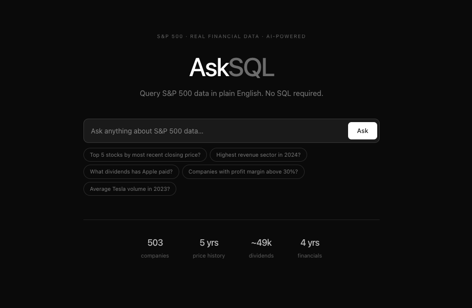
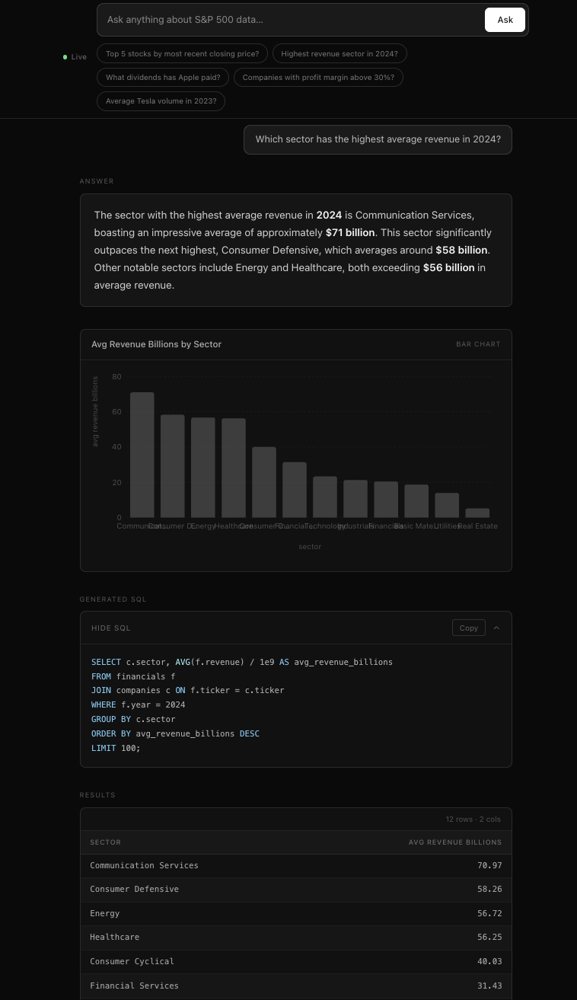

# 📈 AskSQL Markets

A natural-language-to-SQL interface over S&P 500 financial data. Ask questions in plain English and get a generated SQL query, real results, and a plain-English explanation powered by an LLM and a SQLite database of 503 companies.

**🌐 Live demo:** https://asksql-markets.vercel.app

---

## 📸 Screenshots





---

## ✨ What it does

Type a question like, "Which technology companies had the highest profit margin in 2024?", and the app:

1. 🔍 Retrieves relevant schema context via Chroma RAG
2. 🤖 Generates a SQL query using an LLM (OpenAI or local Ollama)
3. ⚡ Executes it against a SQLite database of S&P 500 data
4. 📊 Returns results, a bar/line chart, and a plain-English explanation

---

## 🛠️ Stack

| Layer | Technology |
|-------|------------|
| Frontend | React + TypeScript + Vite + Tailwind + Framer Motion |
| Backend | Python + FastAPI + LangChain |
| Database | SQLite (503 companies, 625k+ price rows, 5 years of data) |
| LLM (local) | Ollama - llama3.2 + nomic-embed-text |
| LLM (cloud) | OpenAI - gpt-4o-mini + text-embedding-3-small |
| Vector store | Chroma (schema RAG) |
| Deployment | Vercel (frontend) + Render (backend) |

---

## 🗂️ Project Structure

```
asksql_markets/
├── backend/
│   ├── agent/
│   │   ├── llm_factory.py       #Swaps between Ollama and OpenAI via env var
│   │   ├── schema_store.py      #Chroma RAG (embeds schema + Q->SQL examples)
│   │   └── sql_agent.py         #Core pipeline: generate SQL -> execute -> explain
│   ├── api/
│   │   └── main.py              #FastAPI: POST /ask, GET /health, GET /schema
│   ├── data/
│   │   ├── models.py            #SQLAlchemy ORM models
│   │   ├── scraper.py           #Wikipedia S&P 500 scraper
│   │   ├── ingest.py            #yfinance data fetcher + bulk upserts
│   │   └── run_pipeline.py      #CLI entry point for full data ingestion
│   ├── eval/
│   │   ├── suite.py             #25 test cases with structural checks
│   │   └── run_eval.py          #Eval runner with rich output + JSON results
│   ├── start.sh                 #Render startup: downloads DB, starts uvicorn
│   ├── render.yaml              #Render deployment config
│   └── requirements.txt
├── frontend/
│   ├── src/
│   │   ├── App.tsx              #State machine: idle -> loading -> done/error
│   │   ├── SearchBar.tsx        #Query input with example chips
│   │   ├── AnswerCard.tsx       #Explanation with number highlighting
│   │   ├── DataChart.tsx        #Auto bar/line chart via Recharts
│   │   ├── SqlDisplay.tsx       #Collapsible SQL block with copy button
│   │   ├── ResultsTable.tsx     #Animated results table
│   │   ├── api.ts               #Fetch wrapper (uses VITE_API_URL env var)
│   │   └── index.css            #Glass morphism, blob animations, grid overlay
│   ├── vercel.json
│   └── vite.config.ts           #Proxies /ask /health /schema -> :8000 in dev
└── README.md
```

---

## 🗄️ Database

SQLite at `backend/data/markets.db` (gitignored). Built by scraping Wikipedia for S&P 500 tickers and fetching data via yfinance.

| Table | Rows | Description |
|-------|------|-------------|
| `companies` | 503 | Ticker, name, sector, industry, headquarters |
| `prices` | around 625,000 | Daily OHLCV - 5 years of history |
| `financials` | around 2,000 | Annual revenue, net income, EPS, profit margin |
| `dividends` | around 49,000 | Full dividend history per ticker |
| `query_history` | - | Logs every question asked |

---

## 🧠 Agent Architecture

Fixed generate→execute→explain pipeline (not a ReAct loop - more reliable across model sizes):

```
Question
  -> Pre-check: regex guard rejects future/prediction questions immediately
  -> Chroma RAG (top-3 schema docs + Q -> SQL examples)
  -> LLM: generate SQL
  -> SQLite execute (retry up to 2x on error, feeding error back to LLM)
  -> LLM: explain results in plain English
  -> Response
```

**Safety guards:**
- Forbidden keyword check blocks `INSERT`, `UPDATE`, `DELETE`, `DROP`, and other write operations
- `CANNOT_ANSWER` path handles questions outside the database scope (future predictions, sentiment, non-S&P companies)
- Results capped at 200 rows with a UI warning to prevent cartesian-product floods

---

## 🚀 Running Locally

### Prerequisites

```bash
#Install Ollama and pull models (one-time)
ollama pull llama3.2
ollama pull nomic-embed-text
```

### Backend

```bash
#Terminal 1
ollama serve

#Terminal 2
cd backend
python -m venv venv
source venv/bin/activate
pip install -r requirements.txt

#Build the database (first time only, about 22 min for all 503 tickers)
python -m data.run_pipeline

#Start the API
uvicorn api.main:app --reload --port 8000
```

### Frontend

```bash
cd frontend
npm install
npm run dev       #dev server on :5173, proxies API calls to :8000
```

Open http://localhost:5173.

---

## 🤖 LLM Provider

Controlled by `LLM_PROVIDER` in `.env`:

```bash
LLM_PROVIDER=ollama   #free, local (requires Ollama running)
LLM_PROVIDER=openai   #requires OPENAI_API_KEY, uses gpt-4o-mini
```

No code changes needed - `llm_factory.py` handles the swap automatically.

---

## 🧪 Eval Suite

25 test cases covering single-table queries, multi-table joins, aggregations, and edge cases. Baseline with llama3.2: **84% pass / 96% usable**. Production uses OpenAI gpt-4o-mini, which scores higher across all categories.

```bash
cd backend && source venv/bin/activate

python -m eval.run_eval                    #run all 25 cases (about 5 min)
python -m eval.run_eval --ids 1 5 11       #run specific cases
python -m eval.run_eval --category join    #run by category
```

Results saved to `eval/eval_results.json`.

---

## ☁️ Deployment

- **Frontend** -> Vercel (auto-deploys from `main`)
- **Backend** -> Render free tier (Python 3.11, 512 MB RAM)
- **Database** -> uploaded as a GitHub Release asset, downloaded at backend startup via `start.sh`

Key environment variables:

| Variable | Set on | Purpose |
|----------|--------|---------|
| `LLM_PROVIDER` | Render | Set to `openai` |
| `OPENAI_API_KEY` | Render | OpenAI API key |
| `DB_DOWNLOAD_URL` | Render | GitHub Release asset URL for `markets.db` |
| `FRONTEND_URL` | Render | Vercel URL (for CORS) |
| `PROTOCOL_BUFFERS_PYTHON_IMPLEMENTATION` | Render | Set to `python` - required for chromadb/protobuf compatibility on Render |
| `VITE_API_URL` | Vercel | Render backend URL |

> ⚠️ Render free tier spins down after 15 min of inactivity - first request after idle takes 50s to wake up. Subsequent requests are fast.
